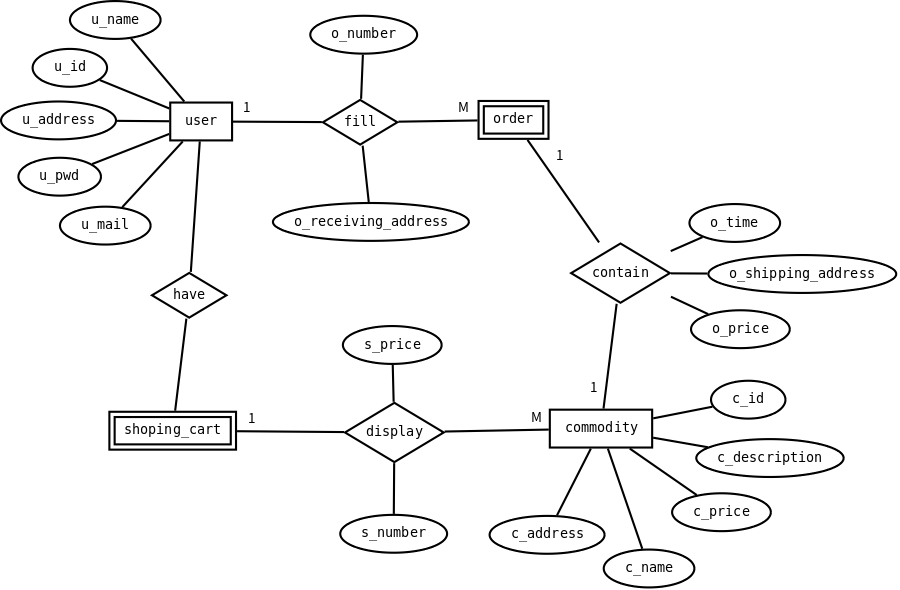

### 实体分析
1. user  
2. commodity
3. shoping_cart
4. order
### 属性分析
1. user: u_id, u_name, u_pwd, u_mail, u_address
2. commodity: c_id, c_name, c_price, c_description, c_address
3. shoping_cart: weak_entity
4. order: weak_entity
### 关系分析
user填写order，购买commodity。一个user拥有一个shopping_cart，一个shopping_cart用来存放物品
### ER图如下
